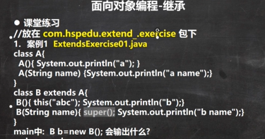

### 接着继承
构造器 子类拥有父类的一切数据和行为
父类先于子类 必须拥有匹配的构造器
super关键字

覆盖 方法重写
子类继承了所有非私有的属性和方法，私有的属性和方法不能在子类直接访问。

super必须放在子类构造器的前面，不写默认调用无参构造器，如果要调用带参构造器，有几个参数就传几个，就跟new的时候一样
super不能跟this共存

Object是所有类的基类

继承的本质 首先看子类的属性 是否有该属性 如果没有接着看父类

super关键字 代表父类的引用，用于访问父类的属性，方法，构造器等  
super 调用面向对象的好处 父类属性由父类初始化