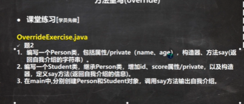
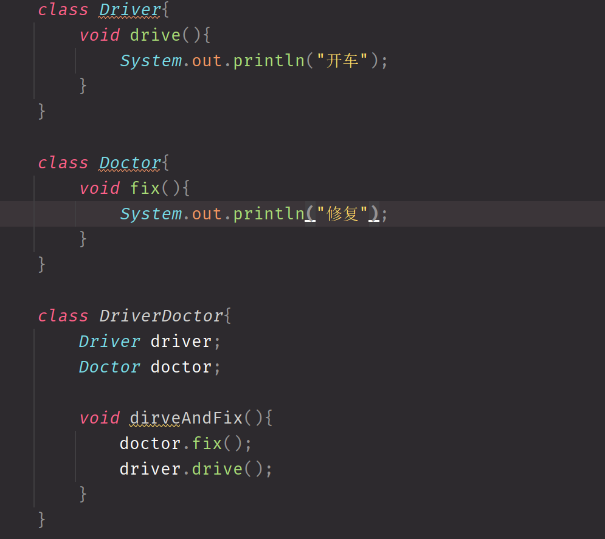

### 方法覆盖  
override 方法重写  
注意事项：
1. 子类方法的参数和父类方法的参数完全一样
2. 子类方法不能缩小父类的权限  

方法重写和重载的区别？
重载的类型，参数个数等等必须有一个不同，重写必须相同。
重载返回类型没要求，重写要求必须一样。
两者方法名都相同，重载发生在同一个类中，而重写发生在子类中
 完成如下练习题  

至此基础的继承已经学习完毕，可以开始提升了  

子类和父类在内存中的表现 在子类被创造的时候，会先调用继承的父类的构造器，直到生成了Object为止  

覆盖 Override   

模板方法 模板方法模式 提供一个模板，提供诸多实现 用户如果想要自定义，则只需要继承即可 
`super.write()`  

向上和向下转型 
Object -> Number -> Integer  对象 -> 动物 -> 猫 -> 白猫  
null instanceof 结果永远都是false

当需要一个父类对象的时候，总可以传递一个子类  
向上转型  Integer -> Object 安全的,自动进行
向下转型 不安全的  无法进行赋值

final 只能被赋值一次，除了构造器之后就不能被赋值了 保证线程是安全的 
public static final double p1 = 3.14... 因为这个参数量不可变，所以我们可以在项目各处用到  
常量的命名约定 全大写  

单例模式 对象 Integer String都是写了final的类 假如可以被继承的话，此时就可以做坏事。
比如Integer的Compare函数，Override一下，返回值全是false，那么到时候网站的判定就会失效了。这样就避免了继承带来的缺陷  

组合 想到同时继承几个类 
不用同时继承几个类  **优先使用组合而不是继承**  
is-a 继承  has-a 组合 为了写一个功能，复用一个已经写好的类，而不是直接继承