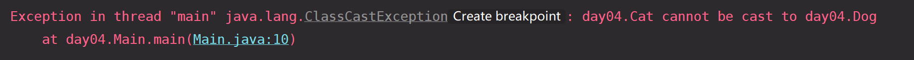
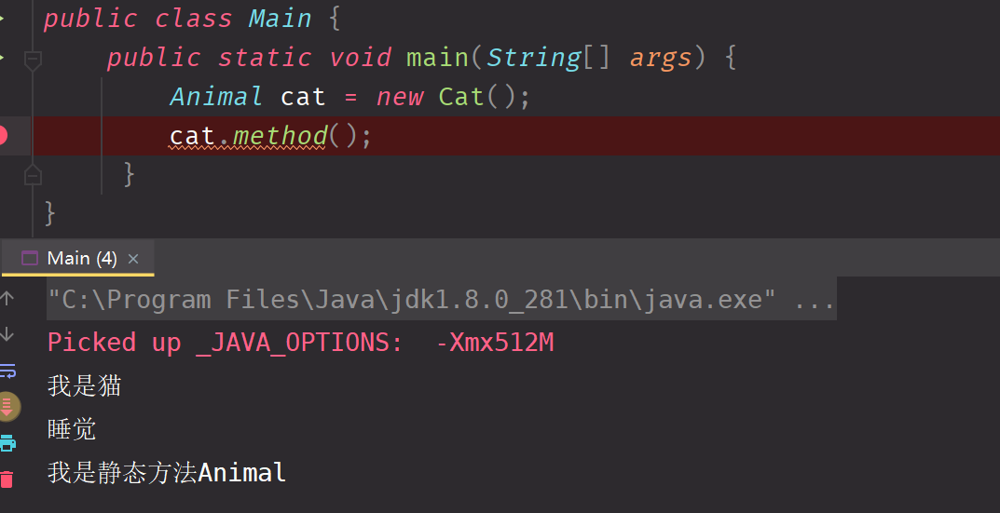

 ### 多态  
 polymorphic 多态  
feed方法会扩展的越来越多 这样就会构成很多很多的重载 使用多态来解决  
对象的多态 核心 将子类的对象赋值给父类  
1. 一个对象的编译类型和运行类型可以不一样
2. 编译类型在定义对象时，就确定了，不能改变
3. 运行类型是可以变化的
4. 编译类型要看定义时，等号的左边

```java 
Animal cat = new Cat();
//此时Animal就是编译类型，但是运行时回去找Cat  
```
编译的时候按照Animal运行，但是运行时会去堆内存找对应的Cat的类型  

使用多态机制可以解决主人喂食物的问题  

向上转型 父类的引用指向了子类的对象 

语法特点 编译类型看左边 运行类型看右边  

structor 结构 在编译阶段，能调用那些成员，是由编译类型来决定的

javac -> animal  java -> 内存中对应的对象  

##### 向上转型
本质：父类的引用指向了子类的对象  
语法：父类类型 引用名 = new 子类类型();  
特点: 编译类型看左边，运行类型看右边

##### 向下转型
本质：将父类的类型强行转化成了子类的类型
语法：父类类型 引用名 = new 子类类型();  
特点: 编译类型看左边，运行类型看右边
此时注意，对应的引用必须强转为之前的的子类型，不能转成Dog这个类型  
  

实例方法 默认是多态的
- 在运行时动态的决定this调用哪个方法 obj.f(1) 实例方法的调用 
obj 方法的接收者 f(1) 方法名 1 方法的参数  
- 静态方法没有多态,多态只发生在实例方法中
 此时已经开始被调用了Animal的静态方法
- 参数静态绑定，接收者动态绑定 (发生场景，被调用者是多态，参数也是多态)  
自己的猜想：被调用者多态 -> 不会变，还是子对象，参数多态 应该是调用传入的对象的编译类型，也就是多态的父类  
实际的值：跟我猜的一样   
我要调用什么方法，是在编译时候已经决定了是什么。多态只对接收方法的接收者生效  

HashSet.addAll(Arrays.asList(1,2)) 在任何时候，实例方法的调用选择都是根据当前对象来决定的  

多态的实践 打折策略  
涉及到金额的时候绝对不可以用double double是不精确的，这是现实世界的数据在计算机中的近似表示
BigDecimal 可以使用这个进行数据的处理  
JDK中的策略模式 thread 线程池   

最大的好处之一：
for [animal a in animalList [] ]{
    Animal a = new Animal();
}

